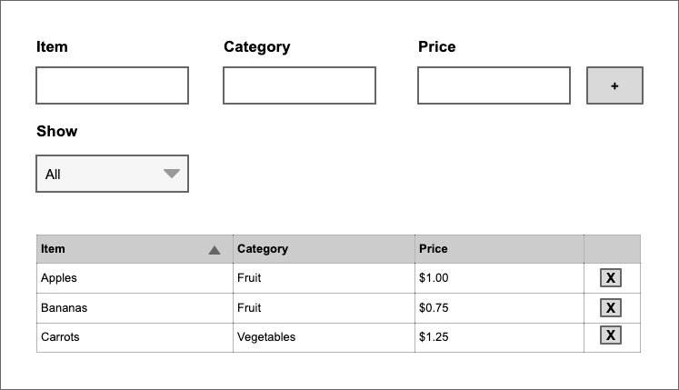
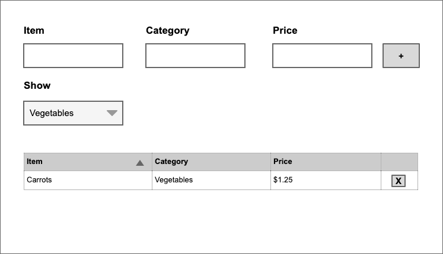

# Bridgit Frontend Code Challenge

*You will need a Github account to complete & submit this challenge*

## Repository Setup
While you may choose to fork this repository, we recommend the following process to create your own repository that isn't obviously linked.

### Private Repo Setup
1. Create a new private Github repository for this challenge. Ex: bridgit-challenge
2. Create a shallow clone of this repository on your machine

```
git clone  https://github.com/Bridgit/frontend-code-challenge.git --branch main --single-branch bridgit-challenge
```

3. Change the remote to your new repository
```
cd bridgit challenge
git remote set-url origin https://github.com/YOUR_GITHUB_ACCOUNT/YOUR_REPO.git
```
4. Push the code to your private repo

```
git push -u origin main
```

5. You're now ready to develop with your private repository. 🎉


## Running the app
1. Install the required dependencies.

```
yarn
```

2. Run the application.

```
yarn start
```

## The Challenge

Implement a react application that allows users to manage a list of categorized items. The application should have the following features:

1. Allow users to create item entries by providing an item name, a category to which the item belongs and a price. Make sure to validate that the value provided for the price is an actual dollar value.
2. Allow users to view the items in a list.
3. Allow users to remove items from the list.
3. Allow users to filter the list of items displayed by category.
4. Allow users to sort the list of items by name, category and price.

These requirements are in order of priority. We want to respect your time and we believe the challenge should not take more than four hours to complete. If you have something you feel demonstrates your abilities, but doesn't hit every requirement on the list, please do submit what you have.

## Available tools

We've added `react-redux`, `Redux Devtools` and `Material UI` as part of this template for you to use. Feel free to use them if they make things easier for you.

## Example

This example is just one way in which the application could be implemented. Feel free to use this as the base for your implementation or use your creativity to come up with your own approach.



### Filter by category



# Notes

At the top level of the directory structure you can find a file named `NOTES.md`. Please feel free to add there any notes related to the implementation of your code. Some things that we would be interested in are:

* Assumptions you made during the implementation process.
* Known limitations of your implementation.
* What you liked or didn't like.
* The challenges you encountered.
* Anything else you'd like to add.

# Deliverables & Submitting Your Results

Please do one of the following:
1. Grant access to your private repository to the Github account indicated.
2. Make your repository public and provide the URL.
3. Don't forget to include your notes!
